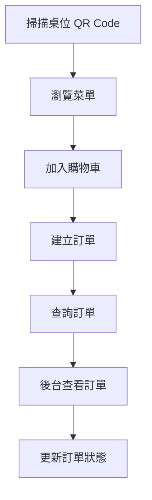
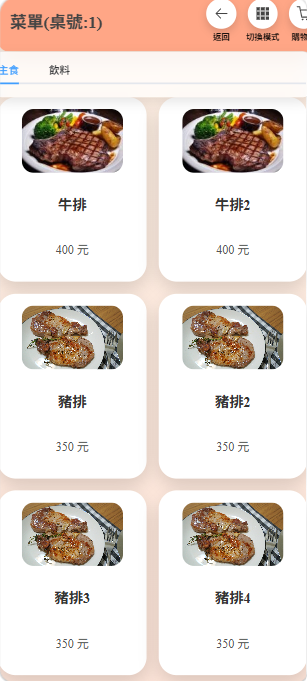
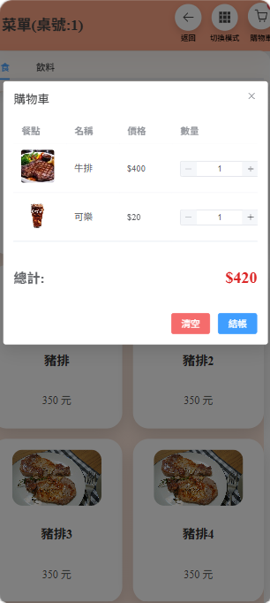
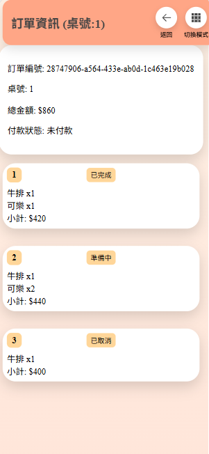
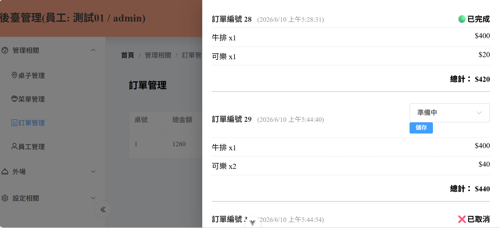
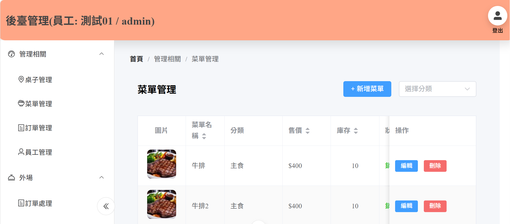
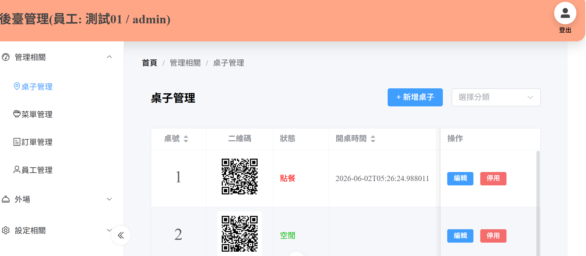
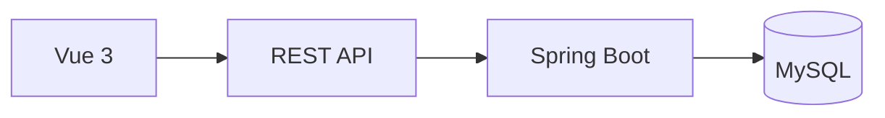
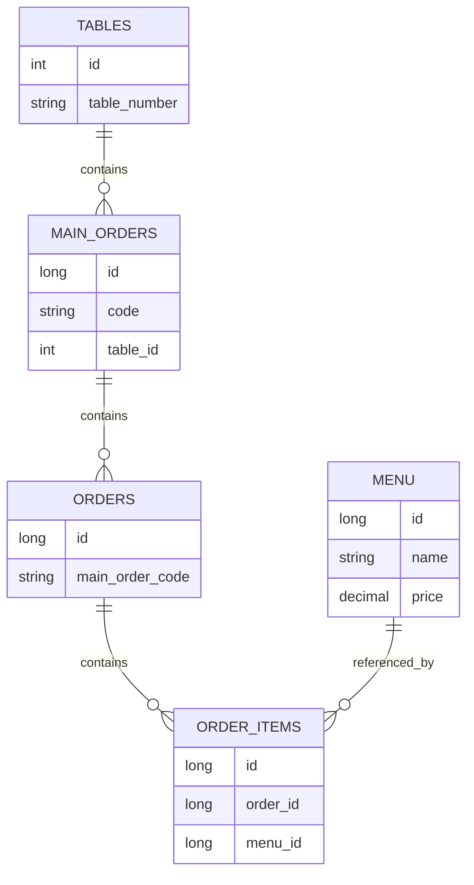

# 內用掃碼點餐系統

近年來許多餐廳採用 QR Code 點餐以提升點餐效率，因此我以此為主題開發一套前後端分離的餐廳點餐系統。

顧客可透過掃描桌位 QR Code 瀏覽菜單並完成點餐，後台則提供菜單、訂單、桌位及員工管理功能。

## 目錄

- [系統功能](#系統功能)
- [系統流程](#系統流程)
- [系統畫面](#系統畫面)
- [系統架構](#系統架構)
- [資料庫設計](#資料庫設計)
- [技術使用](#技術使用)
- [專案心得](#專案心得)
- [相關連結](#相關連結)

## 系統功能

### 顧客端

- 掃描桌位 QR Code
- 瀏覽菜單
- 加入購物車
- 建立訂單
- 查詢訂單

### 後台管理

- 菜單管理
- 訂單管理
- 桌位管理
- 員工管理
- 報表產生

## 系統流程

## 系統流程

## 系統畫面

### 顧客端

#### 菜單頁

  
  
  

  菜單頁 ｜ 購物車 ｜ 訂單查詢

---

### 後台管理

### 訂單管理

#### 菜單管理

#### 桌位管理

## 系統架構

## 資料模型

## 技術使用

### Frontend

- Vue 3
- Pinia
- Vue Router
- Element Plus

### Backend

- Spring Boot
- Spring Security
- JPA
- MySQL
- JasperReport
- JWT（開發中）

## 專案心得

開發初期僅設計 Order 與 OrderItem。

後來考量同桌顧客可能分次點餐但需共同結帳，因此新增 MainOrder 作為訂單聚合單位。

開發過程中也多次調整資料表與 API 設計，包含訂單流程、桌位識別以及登入驗證機制。

透過此專案熟悉前後端分離開發流程、資料模型設計與 RESTful API 串接。

## 相關連結

[Backend Repository](https://github.com/Chun5102/restaurant_order_system_backend)
